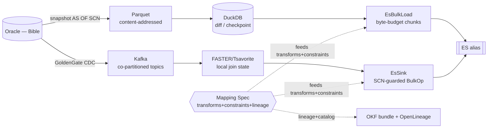

# Oracle → Elasticsearch Bridge

> **Oracle is the Bible. Elasticsearch is the read surface.** Everything downstream
> reads the projection, so the projection's integrity *is* the contract — even though
> ES enforces almost none of Oracle's rules. This bridge makes the copy as trustworthy
> as the original, proves every value's origin, and keeps two write paths from drifting.

---

## 0. How to read this

- **§1–2** frame and vocabulary — read first.
- **§3–8** the architecture — the spec, the folds, constraints, types, the two paths.
- **§9** the operational seams (the parts that don't yield to types).
- **§10–11** testing and lineage/catalog.
- **§12** the phased build (what/how/why/when/exit).
- **§13–14** risk and governance.
- **§15** the four open decisions — *this is what your day of processing is for.*
- **§16–17** sizing, sequencing, appendix.

---

## 1. The one idea

A **single typed mapping spec** is the source of truth. Lineage, SQL generation, ES
generation, integrity enforcement, and the catalog are all **folds** over that one
artifact. Nothing is written twice; nothing can drift, because there is only one place
the truth lives.

```
              TableSpec  (single source of truth)
   ┌───────────┬───────────┬───────────┬───────────┬───────────┐
 compileSql  compileEs   lineageOf    enforce     emitOkf
   │           │           │           │           │
 SqlHydra-   native ES    field       Refined<'T,'P>  OKF bundle
 typed read  mapping +    graph +     witnesses +  (markdown +
 (Oracle/    Query DSL    OpenLineage validation   graph viewer)
  DuckDB)                 facets
```

This is the *only* justification for a unified layer. **Not** query federation — the
two stores are queried in their own idioms. The unification is the spec, and lineage-
by-construction is the payoff.

**Non-goals (stated, not discovered later):**
- No cross-document transactional read consistency in ES (§8, B-S5). Contract is
  per-document eventual consistency. Transactional truth = read Oracle.
- No "one query runs on both stores." Oracle is extract-only; ES is serve-only.
- No SQL→provenance inference from arbitrary Oracle SQL. Lineage is *constructed*, not
  *inferred* (§7).

---

## 2. Vocabulary (self-contained)

| Term | Meaning |
|---|---|
| **SCN** | Oracle System Change Number — monotonic commit clock. The single version/watermark across both paths. |
| **CDC** | Change Data Capture — GoldenGate → Kafka stream of row changes. |
| **Spec / TableSpec** | The single typed artifact: transforms + types + constraints + fidelity + lineage per table. |
| **Fold** | A total function over the spec/expression tree producing one output (SQL, ES JSON, lineage, …). |
| **Capability typing** | Phantom type `'cap ∈ {Sql, Es}` on `Query<'doc,'cap>` so illegal target ops fail at compile time. |
| **Lineage lattice** | `Exact ⊐ Declared ⊐ Opaque` — provenance trust grade per field. |
| **Enforcement lattice** | `Prevented \| Inherited \| Detected` — how a constraint is honored in ES. |
| **Refined<'T,'P>** | Phantom-typed refinement (existing library) carrying a proof predicate `'P` over `'T`. |
| **Coverage dial** | `Exact% / Declared% / Opaque%` and constraint-grade %s — data quality as a *number*, gateable. |
| **Alias-only writes** | All ES writes target an alias; concrete `idx_v{n}` indices are swapped behind it. |
| **Tombstone** | An SCN-stamped delete marker; never a bare `DELETE _id`. |

---

## 3. System architecture

### 3.1 Two paths, one spec



The shared spec is what guarantees `batch(T)` and `realtime(T)` converge to identical,
equally-valid documents. The two arms cannot disagree because they execute the same
transforms and the same constraints from the same artifact.

### 3.2 Functional core / imperative shell

| Layer | Contents | Discipline |
|---|---|---|
| **Core (pure)** | Spec types, `Expr` algebra, all five folds, lineage/enforcement lattices, `Refined` predicates, BulkOp construction. | DUs, `Result`, `option`, no I/O, property-tested. |
| **Shell (impure)** | `ISqlHydraDbProvider` impl, ODP.NET reader, Confluent.Kafka consumer, ES client, DuckDB ADO, file/OKF writes. | Thin; delegates all *decisions* to the core; owns only effects. |

> The unified layer contains **zero execution logic** — pure description + dispatch.
> SqlHydra and the ES client do the running. (Interface impls like `ISqlHydraDbProvider`
> are OO at the FFI boundary — acceptable shell, not a core violation.)

### 3.3 Project layout

```
Bridge.Spec        // core: Column, Expr, FieldSpec, TableSpec, lattices  (no deps)
Bridge.Folds       // core: compileSql/compileEs/lineageOf/enforce/emitOkf
Bridge.Refine      // core: Refined<'T,'P> witnesses + generators
Bridge.Harvest     // shell: ALL_CONSTRAINTS reader -> Constraint list
Bridge.SqlHydra.DuckDB   // shell: ISqlHydraDbProvider implementation
Bridge.Sink        // shell: EsSink (BulkOp) + EsBulkLoad
Bridge.Cdc         // shell: Kafka consumer + FASTER state + SCN guard
Bridge.Catalog     // shell: OKF emit + OpenLineage emit + visualizer
Bridge.Tests       // FsCheck/Expecto property suite
```

---

## 4. The mapping spec (the heart)

### 4.1 Typed column witnesses (SqlHydra is the type source)

```fsharp
type Column<'row,'value> = private Column of name:string
module Person =                              // generated next to the SqlHydra record
    let FirstName : Column<Person,string>   = Column "FIRST_NAME"
    let LastName  : Column<Person,string>   = Column "LAST_NAME"
    let HireDate  : Column<Person,DateTime> = Column "HIRE_DATE"
```

A `Column` is tied to one generated record and carries its CLR type. Cross-row misuse is
a compile error. **SqlHydra is the type source; the DSL is the plumber consuming it.**

### 4.2 Expression algebra — untyped core, phantom-typed boundary

F# has no GADTs, so a single DU cannot refine its result type per case. Use the same
trick `Query<'doc>` already uses: an untyped `Raw` core to fold over, a phantom-typed
boundary with smart constructors that enforce types.

```fsharp
type private Raw =
    | RCol    of string
    | RConcat of Raw * Raw
    | RApply  of fn:string * Raw list
    | RLit    of obj
    | RRaw    of sql:string * Lineage        // escape hatch carries its OWN lineage grade

type Expr<'row,'value> = private Expr of Raw

let col (Column n: Column<'row,'value>) : Expr<'row,'value> = Expr (RCol n)
let concat (Expr a: Expr<'row,string>) (Expr b: Expr<'row,string>) : Expr<'row,string> =
    Expr (RConcat(a, b))                     // wrong-typed concat = compile error

// Escape hatch — TWO forms, no silent `raw : string -> Expr` exists:
let rawWithDeps (sql:string) (cols: Column<'row,_> list) : Expr<'row,'value> =
    Expr (RRaw(sql, Declared (cols |> List.map name |> Set.ofList)))
let rawOpaque   (sql:string) : Expr<'row,'value> =
    Expr (RRaw(sql, Opaque))                 // a deliberate, labeled dark node
```

### 4.3 Lineage lattice

```fsharp
type Lineage =
    | Exact    of Set<string>   // computed from structure — trustworthy
    | Declared of Set<string>   // author-asserted over a raw fragment — checkable, not proven
    | Opaque                    // author opted out — a dark node in the graph

let combine x y =
    match x, y with
    | Opaque, _ | _, Opaque  -> Opaque
    | Declared a, Declared b -> Declared (a + b)
    | Declared a, Exact b
    | Exact a, Declared b     -> Declared (a + b)   // any Declared contamination caps the grade
    | Exact a, Exact b        -> Exact (a + b)
```

### 4.4 Field and table spec

```fsharp
type FieldSpec<'row> =
    { Target   : string            // ES field name
      EsType   : EsType            // text / keyword / long / double / date / boolean / nested
      Expr     : Raw               // the transform (or pass-through col)
      Lineage  : Lineage           // computed once, at construction
      Required : bool              // NOT NULL → erased to non-option at the typed edge
      Refine   : RefineTag list    // CHECK → Refined<'T,'P> witnesses
      Loss     : Lossiness }       // type-fidelity grade (see §6)

type TableSpec =
    { Source   : string
      Index    : string            // an ALIAS, never a concrete index
      Key      : KeySpec           // PK → deterministic _id basis
      Scn      : ScnColumn         // version/watermark source
      Fields   : FieldSpec<obj> list
      Detected : DetectedConstraint list }   // secondary UNIQUE / FK (reconciliation-only)
```

### 4.5 The mapping is the proof

```fsharp
let mapField (target: EsField<'value>) (Expr raw: Expr<'row,'value>) : FieldSpec<'row> =
    { Target = target.Name; EsType = target.Ty; Expr = raw
      Lineage = lineageOf raw; Required = target.Required
      Refine = []; Loss = Lossless }
```

The ES target's value type must equal the expression's value type — a `string` concat
into an `integer` field will not typecheck. **Types-as-proofs for the whole Oracle→ES
edge, not just the expression.**

### 4.6 The four field kinds, concretely

```fsharp
let personMapping = [
    mapField Es.firstName  (col Person.FirstName)                          // Exact {FIRST_NAME}
    mapField Es.fullName   (concat (col Person.FirstName)
                              (concat (lit " ") (col Person.LastName)))    // Exact {FIRST_NAME,LAST_NAME}
    mapField Es.tenureBand (rawWithDeps
        "CASE WHEN MONTHS_BETWEEN(SYSDATE,HIRE_DATE)>120 THEN 'senior' ELSE 'junior' END"
        [ Person.HireDate ])                                               // Declared {HIRE_DATE}
    mapField Es.riskScore  (rawOpaque "PKG_RISK.SCORE(EMP_ID)")            // Opaque (honest dark node)
]
// coverage: 50% Exact, 25% Declared, 25% Opaque — a gateable number.
```

---

## 5. The five folds

| Fold | Input | Output | Notes |
|---|---|---|---|
| `compileSql` | `Query<'doc,Sql>` | `SqlText` | through SqlHydra/SqlKata; capability-typed so ES-only ops are a compile error |
| `compileEs` | `Query<'doc,Es>` | `EsJson` | native Query DSL; relevance/aggs/nested available |
| `lineageOf` | `Raw` | `Lineage` | free-variable fold; sound-but-conservative (over-reports, never misses) |
| `enforce` | `Constraint` | `Enforcement` | classifies into the §6 lattice; generates `Refined` witnesses |
| `emitOkf` | `TableSpec` | `OkfBundle` + OpenLineage | catalog + visualizer; cross-links = edges |

```fsharp
let rec lineageOf = function
    | RCol n       -> Exact (Set.singleton n)
    | RConcat(a,b) -> combine (lineageOf a) (lineageOf b)
    | RApply(_,xs) -> xs |> List.map lineageOf |> List.fold combine (Exact Set.empty)
    | RLit _       -> Exact Set.empty
    | RRaw(_,decl) -> decl
```

**Conservativeness, stated:** `lineageOf` is *sound, not minimal*. `substr(x,0,0)`
reports a dependency on `x` though the output never varies with it. For ETL column
lineage this bias is correct — over-report, never miss. Minimal lineage needs
perturbation analysis you do not want.

---

## 6. Constraints & type fidelity

### 6.1 Enforcement taxonomy

```fsharp
type Enforcement = Prevented | Inherited | Detected
```

| Oracle constraint | ES capability | Grade | Mechanism |
|---|---|---|---|
| NOT NULL | type-level | **Prevented** | erase `option`; gated on `'' = NULL` read refinement (§6.3) |
| simple CHECK (range/IN/length/precision) | per-row | **Prevented** | generate `Refined<'T,'P>` witness |
| PRIMARY KEY | `_id` | **Inherited** | deterministic SHA `_id` from PK; last-write-wins dedups |
| secondary UNIQUE | none (write) | **Detected** | reconciliation agg; *Prevented-in-stream* iff co-partitioned by that key |
| FOREIGN KEY | none | **Detected / N-A** | reconciliation, or moot if denormalized/embedded |
| complex CHECK (PL/SQL) | none | **Declared / Opaque** | carry text + asserted cols, or dark node |

**Honest headline:** NOT NULL, simple CHECK, type/length, and PK are *real proofs*.
Secondary-unique and FK are *detect-only* and eventually-consistent in the CDC arm.
Build the API so that distinction is impossible to ignore.

### 6.2 Harvested constraint model (closed subset = the scope firewall)

```fsharp
type CheckPred =
    | Range     of lo:Bound * hi:Bound
    | InList    of string list
    | Length    of max:int
    | Precision of int * int
    // ANYTHING else is NOT a CheckPred → becomes Declared/Opaque raw.

type Constraint =
    | NotNull
    | Check      of CheckPred
    | PrimaryKey
    | Unique     of string list
    | ForeignKey of refTable:string * refCols:string list
```

The supported CHECK subset is the single rule that stops the parser from sprawling into
a mini-compiler (your known scope-creep failure mode). Everything outside the subset
degrades to a coverage number, not a parser feature.

### 6.3 Type fidelity table + the `'' = NULL` trap

```fsharp
type Lossiness = Lossless | LossyPrecision | LossyTimezone | BlobRef
```

| Oracle type | ES type | Lossiness | Note |
|---|---|---|---|
| VARCHAR2 / CHAR | keyword / text | Lossless | `''` reads as NULL — see below |
| NUMBER(p,s) | long / double / scaled_float | Lossless / LossyPrecision | arbitrary-precision NUMBER overflows `double` |
| DATE | date | Lossless | no tz |
| TIMESTAMP WITH TZ | date | LossyTimezone | normalize to UTC, keep offset as sibling field if needed |
| CLOB / NCLOB | text | Lossless* | large-field indexing cost |
| BLOB / RAW | binary / ref | BlobRef | store ref, not bytes |

**The trap:** Oracle stores empty string *as NULL*. A `NOT NULL VARCHAR2` can therefore
still yield NULL at read — silently breaking the NOT-NULL → non-option erasure. So
erasure is gated on a *read-time* refinement, not just the DDL flag:

```fsharp
let parseRequired : string -> Result<NonEmpty, IntegrityError> = ...
// NOT NULL is a TYPE (non-option) only after this parse succeeds.
```

Lossy mappings surface as a coverage figure, same pattern as lineage grades.

---

## 7. Lineage: constructed, not inferred

Two very different things hide in "automatic":

- **Construction (what we do):** the transform lives in the DSL, so each target field's
  provenance is the *free variables* of its expression — known, exact, free. This is
  `lineageOf`.
- **Inference (what we avoid):** parsing arbitrary Oracle SQL/procs to recover provenance
  through joins/CASE/subqueries. A separate, lossy static-analysis project. Out of scope.

**Corollary (the hard one):** lineage coverage = the DSL's monopoly on transforms. Every
`rawOpaque` escape hatch goes dark. "Every field, source→target" is *exactly* as complete
as the transform DSL is mandatory. This is decision **D1** (§15).

---

## 8. The two paths & their convergence

### 8.1 Batch (snapshot) arm
`Oracle AS OF SCN X` (flashback = consistent point-in-time) → content-addressed Parquet
→ DuckDB diff vs last checkpoint → `EsBulkLoad` (byte-budget chunks, wave concurrency,
Writer-lineage) → ES alias. Deletes inferred by *absence* in the diff.

### 8.2 Realtime (CDC) arm
GoldenGate → Kafka (co-partitioned by aggregate key) → FASTER/Tsavorite local state for
join materialization → `EsSink` SCN-guarded `BulkOp` → ES alias.

### 8.3 The shared BulkOp algebra (deletes are first-class)

```fsharp
type BulkOp =
    | Upsert    of id:DocId * doc:Json * scn:Scn
    | Tombstone of id:DocId * scn:Scn          // SCN-stamped delete, NOT a bare DELETE
```

### 8.4 Convergence guarantees

- **PK → `_id`:** equal PK ⇔ equal `_id`; PK collisions dedup by last-write-wins.
- **SCN version guard:** every write uses ES `external_gte` versioning on the SCN. A write
  with SCN ≤ the doc's current version is rejected. This makes the at-least-once Kafka
  stream *effectively* exactly-once per key, and makes the snapshot/stream overlap window
  safe to replay (B-S3).
- **Tombstone monotonicity:** a delete writes a tombstone at its SCN; any later upsert with
  SCN ≤ tombstone SCN is rejected → no resurrection (B-S2). GC tombstones after a retention
  window > max expected stream lag.
- **Cutover watermark:** snapshot to SCN X; stream from SCN > X. X recorded in the run manifest.
- **Co-partitioning upgrade:** secondary UNIQUE becomes *Prevented-in-stream* only when the
  topic is keyed by that unique column (single-writer-per-key ordering). Otherwise Detected.

---

## 9. Operational seams (the five that don't yield to types)

| ID | Seam | Why it bites | Resolution | Phase |
|---|---|---|---|---|
| B-S1 | ES mapping immutability | indexed field type can't change in place; reindex = billions of rows | alias-only writes; spec-diff classifier additive-vs-breaking; `idx_v{n+1}` + atomic alias swap + rollback retention | 5 |
| B-S2 | Deletes / resurrection | late delete races re-insert | SCN tombstones + version guard (property 5) | 3 |
| B-S3 | Snapshot↔stream cutover | overlap double-applies or drops | flashback `AS OF SCN` watermark + idempotent replay | 3 |
| B-S4 | `'' = NULL` + type fidelity | breaks NOT-NULL erasure; precision/tz loss | read-time `parseRequired`; fidelity table + lossiness coverage | 1+2 |
| B-S5 | No cross-doc transactions | reader sees partial multi-row commit | **stated non-goal**: per-doc eventual consistency; transactional truth = Oracle | contract/0 |

Minor (track, don't gate): PII classification tags in OKF + scrub sample values; spec
ownership/CI loop; text-vs-keyword choice gating Detected-uniqueness queries.

---

## 10. Testing strategy (every grade has a guardian)

```fsharp
// 1. SOUNDNESS — any row violating a Prevented constraint is always rejected.
// 2. COMPLETENESS — a fully-valid row is NEVER falsely rejected.
// 3. PK → _id — equal PK <=> equal _id (catches a dropped key column collapsing rows).
// 4. DECLARED LIE-DETECTOR — perturb an UNdeclared column; output must not move.
//    Reused for Declared transforms AND Declared CHECKs.
// 5. SCN CONVERGENCE / NO-RESURRECTION — all event interleavings converge to the
//    highest-SCN state.

let ``declared deps are honest`` spec =
    Prop.forAll (declaredFieldGen spec) (fun (field, row) ->
        let undeclared = allCols spec - declaredOf field.Lineage
        Prop.forAll (perturbGen undeclared) (fun row' ->
            evalField field row = evalField field row'))

let ``scn convergence is order-independent`` events =
    events
    |> List.permutations
    |> List.map (List.fold applyGuarded EsAbsent)
    |> List.distinct |> List.length = 1
```

| Grade | Guardian |
|---|---|
| `Exact` | sound by construction (no test needed) |
| `Inherited` | property 3 |
| `Detected` | exempt from write-proof; covered by reconciliation (§11) |
| `Declared` | property 4 (lie-detector) |
| ordering/deletes | property 5 |

Plus: round-trip retraction with classified loss (existing pattern) for field validation;
integration acceptance per phase (§12 exit criteria).

---

## 11. Lineage delivery & catalog (OKF)

- **OKF is a *format and sink*, not a lineage engine.** It's markdown + YAML frontmatter,
  cross-links as graph edges, with a self-contained HTML visualizer. Decoupled from
  GCP/Dataplex entirely — just emit bundles.
- **Source of lineage:** `lineageOf` at spec-compile time → OpenLineage column-lineage
  facets emitted from *both* arms → `emitOkf` renders the bundle (one concept per
  table/field, edges = `deps`).
- **Coverage dial:** `Exact% / Declared% / Opaque%` per table and aggregate; constraint
  grade %s; lossiness %s. This is the governable artifact (§14).
- **Reconciliation (for Detected):** generated ES aggregation queries surface secondary-
  unique / FK violations into the dial — the only honest "enforcement" of set-level
  constraints in ES.

---

## 12. Phased build

Each phase is a thin vertical slice with an explicit exit gate. Don't start N+1 until N's
gate is green.

### Phase 0 — Walking skeleton · size S
- **What:** one table, Oracle→Parquet→ES, SCN-versioned idempotent upsert on existing
  `EsSink`; one hand-written OKF node; write the per-doc-consistency non-goal (B-S5) into
  acceptance criteria.
- **Why:** prove the *format* end-to-end before any engine. Kills completeness-before-contact.
- **Exit:** one row provably traceable source→target; replaying the load is a no-op.

### Phase 1 — DuckDB provider + nullability + null trap · size M
- **What:** `ISqlHydraDbProvider` for DuckDB (`GetSchema` via `information_schema`,
  Postgres-ish `SqlEmitter`). NOT NULL → option erasure gated on `parseRequired` (B-S4).
- **Why:** cheapest type-level constraint win; DuckDB is the diff/staging layer; provider
  is upstream-contributable.
- **Exit:** generated types compile; a NULL in a `NOT NULL` column is rejected with a typed
  error, not a crash.

### Phase 2 — Harvester + spec + folds + fidelity · size L (the core)
- **What:** read `ALL_CONSTRAINTS`/`ALL_CONS_COLUMNS` (P/U/R/C) → `Enforcement` lattice;
  build the fidelity table; fold all into the typed spec; generate `Refined` witnesses + ES
  mapping (text/keyword) + OpenLineage facets + OKF bundle.
- **Why:** the unification that earns its keep — one artifact, all folds, both paths enforcing
  the same constraints.
- **Note:** SqlHydra gives types + nullability; the richer harvest (UNIQUE/CHECK/FK) is your
  own dictionary read.
- **Exit:** properties 1–4 green; coverage dial renders real %s for a real table.

### Phase 3 — CDC convergence + deletes + cutover · size L
- **What:** stream runs the same spec; co-partitioned keys upgrade secondary-unique to
  Prevented-in-stream; SCN tombstones (B-S2); flashback `AS OF SCN` cutover (B-S3).
- **Why:** shared spec ⇒ batch(T) ≡ realtime(T).
- **Exit:** property 5 green; a delete→reinsert race never resurrects; snapshot+stream overlap
  replays cleanly.

### Phase 4 — Reconciliation for Detected · size M
- **What:** generated ES aggregations surfacing secondary-unique/FK violations into the dial.
- **Why:** the only honest set-level "enforcement."
- **Exit:** seeded violations are detected and reported with field-level attribution.

### Phase 5 — Schema evolution / alias-swap reindex · size M-L
- **What:** alias-only writes; spec-diff classifier (additive vs breaking); breaking →
  `idx_v{n+1}` reindex + atomic alias cutover + rollback retention (B-S1).
- **Why:** the first production field-type change at billion-row scale is an outage without it.
- **Exit:** a breaking spec change reindexes + swaps with zero read downtime; rollback works.

---

## 13. Risk register

| ID | Risk | Severity | Mitigation |
|---|---|---|---|
| B1 | CHECK parsing unbounded | M | supported subset; rest → Declared/Opaque % |
| B2 | secondary-unique/FK not write-preventable | H | Detected; co-partition upgrade where possible |
| B3 | Oracle constraint drift | M | versioned in spec; CI-diffed; blocks deploy |
| B4 | `Refined` witness codegen | M | generate subset; hand-annotate Declared |
| B5 | ES mapping immutability | H | alias-swap reindex (Phase 5) |
| B6 | delete resurrection | H | SCN tombstones + guard (property 5) |
| B7 | snapshot/stream overlap | H | flashback SCN watermark + idempotent replay |
| B8 | single-maintainer sprawl | M | closed AST forced by agent-tool surface; phase gates; no execution logic in core |
| B9 | NUMBER precision overflow | M | fidelity table; scaled_float/string fallback for arbitrary precision |

---

## 14. Governance (SpecKit)

- **Spec is law:** the SCN-stamped, versioned spec is the only source. A DBA constraint or
  schema change appears as a **spec diff in CI**, never silent drift. Spec diff is a hard
  deploy gate.
- **Coverage gates:** policy decides whether the build *fails* or *reports* when `Opaque%`
  (or `Declared%`, or lossiness%) crosses a threshold (decision **D2**, §15).
- **Ownership loop:** define who edits the spec on Oracle change and that the edit is
  reviewed before the pipeline runs (decision **D4**).
- **PII:** OKF concepts carry data-classification tags; bundles are scrubbed of sample
  values before git commit.

---

## 15. Open decisions — *this is your day-of-processing work*

Everything past these four is build, not design.

### D1 — Is `rawOpaque` in the API, or is `rawWithDeps` mandatory?
- **Option A (rawOpaque allowed):** pragmatic; some fields go dark; "every field source→target"
  becomes *aspirational* + a coverage %.
- **Option B (rawWithDeps-only, Opaque banned):** every target keeps edges; every assertion is
  test-checkable; graph stays fully connected; "every field" becomes *achievable*.
- **My lean:** B for any field feeding a governed/PII/audited surface; A tolerated elsewhere
  with a hard `Opaque%` ceiling. **Unblocks:** the Phase-2 harvester API shape.

### D2 — Coverage contract: fail-the-build or report-and-ship?
- **Fail:** strongest guarantee; can block delivery on legacy tables with messy CHECKs.
- **Report:** ships; risks the dial being ignored.
- **My lean:** fail on `Opaque%` over a per-domain ceiling; report on `Declared%`/lossiness.
  **Unblocks:** the CI gate wiring.

### D3 — Secondary-unique / FK: detect-only, or first-class co-partitioned enforcement?
- **Detect-only:** simplest; eventual; reconciliation report.
- **Co-partitioned single-writer:** prevent-in-stream for the keyed column; more topology
  and key-routing design.
- **My lean:** detect-only baseline; co-partitioned enforcement only for the 1–2 business-
  critical uniqueness rules. **Unblocks:** Phase-3 topology + Phase-4 scope.

### D4 — Spec ownership & CI loop
- Who authors spec changes on Oracle DDL change; is the spec diff a hard gate; what review.
- **My lean:** spec lives in `ai-skills`-adjacent repo; DDL change → harvester proposes a spec
  diff → human review → gate. **Unblocks:** governance sign-off.

---

## 16. Sizing & sequencing

```
0 (S) ──> 1 (M) ──> 2 (L, core) ──┬──> 3 (L) ──> 4 (M)
                                  └──> 5 (M-L)   [design in 2, build before first breaking change]
```
- Critical path runs through Phase 2; 4 and 5 can parallelize after 3 starts.
- D1/D2 gate Phase 2. D3 gates Phase 3/4. D4 is governance, parallel.
- Phase 0 needs no decisions — start it regardless.

---

## 17. Appendix — conventions

- **Naming:** ES fields camelCase; Oracle columns UPPER_SNAKE; spec keys = Oracle name.
- **Determinism:** `_id = sha(PK columns in declared order)`; never include mutable fields.
- **Versioning:** every write carries `version_type=external_gte, version=scn`.
- **Telemetry:** Writer monad lineage on every fold and every `BulkOp` wave.
- **Idempotency invariant:** `apply(apply(s, op), op) = apply(s, op)` — property-tested.
- **F# discipline:** DUs over classes; `Result` over exceptions; `option` over null; phantom
  types for capability + refinement; no execution logic in `Bridge.Spec`/`Bridge.Folds`.

---

*Core design is locked. The four decisions in §15 are the only thing standing between this
document and a build. Take the day.*
